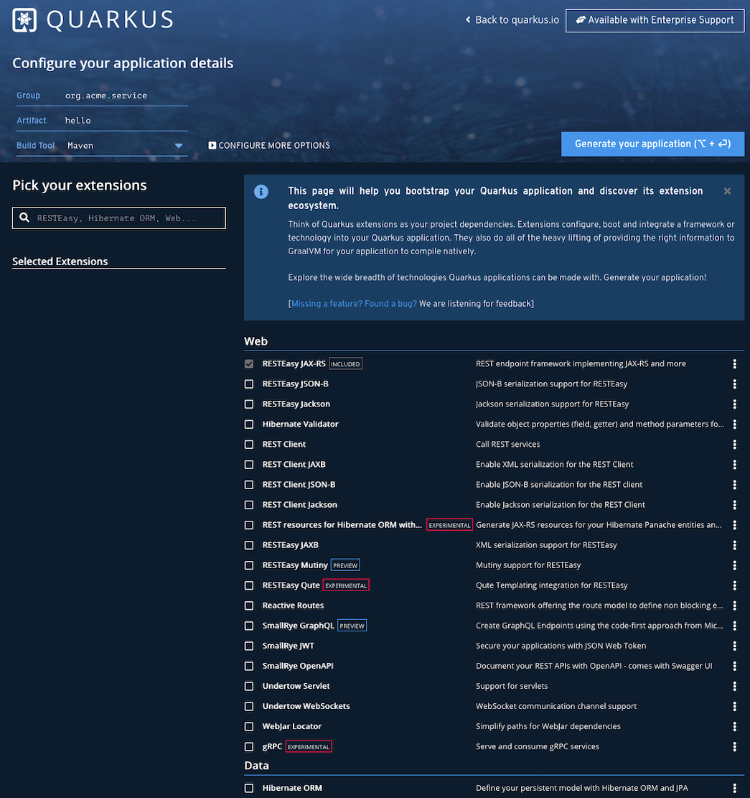

How prefers working graphically, can head over to 

https://code.quarkus.io/

Here you can select available frameworks/libraries you want to use from the beginning when creating your application.

Adjust *Group* and *Artifact* to your liking and perhaps change the build to to *Gradle*.

In the text field *Pick your extensions* you can search for the desired framework/library.

